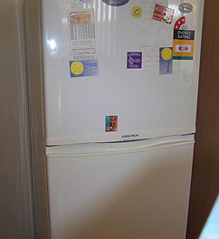

介绍
============

关于
------

在这本书里你将学习C语言，并且同时学习如何打造*你自己的编程语言*，一个最小化的 Lisp，实现代码不超过1000行！我们将会用到一个库来做一些初始化工作，所以实际上真正的行数不止这么多，但是剩下的代码都是原创的，而且到最后你真的将会创造一个强的小型 Lisp
。

这本书受到了一些在线教程的启发，例如 [ Write Yourself a Scheme in 48 Hours](http://en.wikibooks.org/wiki/Write_Yourself_a_Scheme_in_48_Hours),讲述如何从头一步一步构建一个语言。我写这本是为了表明这种有趣的，又创造性的项目是学习一门语言的好方法，并不局限于抽象的高级语言，或者是有经验的程序员。

很多人都热衷于学习C语言，但是不知道从哪里开始。这是你的借口，如果你遵循这本书我可以保证，即使是在最坏的情况下，你会学到一个很酷的新语言，希望你也会成为一个经验丰富的C语言程序员。

这本书是为谁准备的
---------------

这本数是为任何一个想要学习C语言，或者曾经想要构建一个自己的编程语言的人。这本书*不适合*作为第一本程序语言书籍，但是任何有一点语言的编程经验的人都能在这本书里找到一些新的和有趣的东西。

我试图让这本书对初学者尽可能的友好，我最欢迎初学者，因为他们有如此多的东西去发现！但是初学者也会发现这本书很难，我们会涉及到大量的新概念，并且基本上一次学习了两种语言。

如果你正在寻求帮助人们可能会对你没有耐心。你可能能会发现，比起耐心的帮助，他们会花更多的时间表达他们对这个主题很了解。经验丰富受人尊敬的人可能会告诉你你错了。他们的语气暗示你应该马上停止，而不是给这个世界带来你糟糕的代码。

这样几次之后你可能判定你自己*不适合成为一名程序员*，*不是真正爱编程*，或者*就是没办法弄明白*。你可能会想你曾经喜爱这个打造你自己的编程语言的想法，但是现在你不得不意识到这对你来说太深奥，你也就*不再关心*了。现在你忙于你的其他爱好，原本有趣好玩的探索现在都变成了阻碍。

对此我只能抱歉。程序员可能是有敌意的，男子气概的，傲慢的，不安全的，咄咄逼人的。这种行为没有理由。记住我站在你这一边。没有人是一开始就懂得的。每个人都很努力并且怀疑自己的能力。请不要放弃或者失去创造性的体验。无论你创造的东西是什么，你都应该为它感到骄傲。像我一样的人们不希望你停止编程。我们希望听到你的声音，你想说什么，即使你不喊的像别人一样响亮。

为什么学习C语言
-----------

C语言是这个世界上最受欢迎和最有影响力的语言之一。这是 Linux 开发首选的语言，而且在某种程度上被广泛用于 OS X 和 Microsoft Windows 的创造。它也被用在微型计算机上。你的电冰箱或者是汽车可能正在运行着它。任何想要做职业软件开发者的人都应该学习C语言。

但是C并不是象征着软件开发和职业。C语言象征着*自由*。它作为自由协作的技术一举成名 - Unix,Linux,和自由软件运动。它代表着个人理念的自由。它让你控制技术来影响你的生活。

在这个时代，技术比以往更强大，没什么比这个更重要的。

自由的思想反映在C语言本身的很多地方。C语言很少从你面前隐藏什么东西，包括它的缺点。C语言很少阻止你去做什么，包括用很糟糕的方式来中断你的程序。当用C语言编程时你不是站在一条路上，而是在一个平面上做决策，而C语言做你决定要做的事情。

C语言同样是一个学习和获取乐趣的语言。在这些事出现在主流媒体之前我们有个词，叫做 *黑客(Hacking)*. 这种哲学崇尚乐趣和聪明，和非法接入未授权的电脑*没有关系*。黑客是勘探，表达个人的理念，推动的界限，打破规则的哲学。它反对等级制度和官僚机构。它为个体喝彩。它通过乐趣，学习，和荣耀来诱惑你。黑客保证只要有接入互联网的网络，你就有力量来改变世界。

为了掌握C语言, 你应该关注什么是强大的，有趣的，聪明的，自由的。要成为一个有广阔的技术力量的程序员。并且有责任说"*我会做好这些*"。

如何学习C语言
--------------

没有办法，C语言是一门很难的语言。它有着很多不熟悉的概念，它也没有试图帮助一名新用户。这本书我不打算详细介绍它的语法，或是如何编写循环和条件语句。

另一方面，我会想你展示如何去构造一个*真实*的C语言项目，这种方法对于读者来说更加困难，但是希望能交给你很多传统方法不能教会的东西。我不能保证这本书会让你成为一个自信的C语言使用者。我能保证的是，这1000行代码充满了这本书的内容，而你将学到*一些值得学习的东西*

这本书由16个短章组成。你能将这些完成的如何取决于你自己。可能是在一个周末快速的看完，或者更慢一点，在一两周的时间内每天做一两个章节。它不需要很长时间就能完成，并且希望能在未来让你体验开发你自己的语言。

为什么打造一个Lisp
----------------

我们在这本书里要打造的语言是一个Lisp。这是一个家族的编程语言，它们的特点是所有的计算由*列表(list)*表示。这听起来很可怕。但是其实 Lisp 很是简单，与众不同，和强大的语言。

打造一个 Lisp 是一个很好的工程，原因有很多。这让你作为一个语言设计师， 并且让你可以欣赏编程中到从语言到机器的全过程。它会教你有关函数式编程和一种不同的看待计算范式(computation)的方法。你最终得到的产品将会为你未来的思考和开发提供模板，给你一种开始尝试新事物的方法。在编程和计算机科学的世界不可能理解创造新和聪明除非你探索语言本身。

我们即将打造的 Lisp 是我为这本书发明的。我把它设计得尽可能简单明了,而且我非常喜欢它前进的道路。我希望你也能够喜欢。从概念上，语法上，和执行上说，这个 Lisp 与其他主流的 Lisp 有很大的不同。这些不同是如此之多以至于我确信我会受到 Lisp 程序员的 e-mail ,他们会告诉我这不是一个 Lisp 因为它不是/没有/看起来不像这样或者那样的东西。

我对 Lisp 做这些改动不是为了迷惑初学者或者散步不实之词。我之所以改动它是因为这些改动都是好的。

如果你正在找书学习常规 Lisp 的语法,特性以及如何用他们编程，那这本书可能不适合你。这本书能提供的是一些新的，独特的角度，自我表达，创造性和乐趣。无论你的动机是什么，*注意这个免责声明。并不是我说的每一件事都是正确的或者真实的！你需要为你自己下决定。*

你自己的 Lisp
-------------

阅读这本书最好的办法，正如标题所说的，写*你自己的* Lisp。如果你足够自信我希望你能够添加自己的特性，修改和变化。你自己的 Lisp 应该切合你自己关于正确的哲学。在这本书中我将给出描述和见解，而且我还会提供*大量*的代码。这会让你很容易地将每一节的代码复制粘贴进自己的程序，即使你一点都不理解。 *请不要这样做！*

自己打出每一段简单的代码。这叫*来之不易(The Hard Way)*.并不是因为它是一个艰难(Hard)的技术，而是因为它要求纪律。通过用艰难的方法来做这些事你最终将会理解你所输入的东西背后的原理。理想的情况下，事情将会跟着你字母的节奏变得清晰。当你阅读的时候你可能会有一种直觉，关于它为什么*看起来*是正确的，或者*可能*可行，但这往往都不会真正的被理解除非你自己*写*。

最理想的情况是你可能会用我的代码作为参考 - 一个指令手册和一门指导如何构建你梦想的语言的书。而事实上这是不可行的。但是基础的理念仍然在。如果你想改变什么，那就去做吧。
